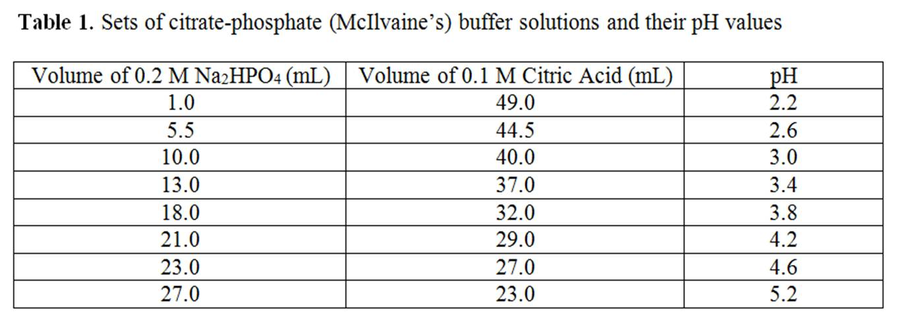
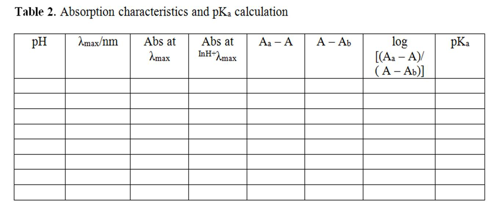

1. Prepare the following solutions: (i) a 0.5g/L methyl orange solution by dissolving 0.05 g methyl orange in 100 mL distilled water; (ii) a 0.2 M disodium hydrogen orthophosphate (Na 2 HPO 4 ) solution by dissolving 5.68 g Na 2 HPO 4 in 200 mL distilled water; and (iii) a 0.1 M citric acid solution by dissolving 9.61 g citric acid in 500 mL distilled water.
2. Prepare eight buffer solutions by mixing varying amounts of the Na 2 HPO 4 solution and the citric acid solution as given in Table 1.
3. Divide each buffer solution into two equal portions of 25 mL volume.
4. Add 0.5 mL of methyl orange solution to one 25 mL portion of each buffer solution. Absorbance measurements of the buffer solutions containing the methyl orange indicator have to be carried out against the other portions of buffer as the reference or sample blank. These sample solutions are shown on a selection scale.
5. Switch on the computer and the instrument powers; wait for 30 minutes for "warm-up" of the instrument.
6. In the instrument one can select light sources (UV and visible), choose the slit width, scan speed and %transmittance or absorbance display, wavelength range of interest, etc.
7. Take a clean and dry or properly rinsedquartz cuvette with a given path length (say, 1 cm).
8. Fill up one cuvette with sample blank (pure buffer solution) and the other cuvette with corresponding buffer solution containing methyl orange solution.
9. Place the sample blank in the reference holder and the sample in the sample holder.
10. Run the scan (A versus ¦Ë) for each samplein the wavelength range from 300 to 650 nm.
11. Now find out the wavelengths of maximum absorbance (λ max ), corresponding absorbance, the absorbance at InH + λ max for all the pH values and make a table containing these data (Table 2).
12. Discuss how λ max and corresponding absorbance vary with pH of the solution.
13. Calculate pK a for each pH value. Find the average pK a .
14. Plot pH vs. log([In]/[InH + ]). Determine pK a from the intersection of the line with the pH axis.
15. Compare the graphically determined pK a value with the calculated average pK a value.
16. Determine the acid dissociation constant, K a for methyl orange.

